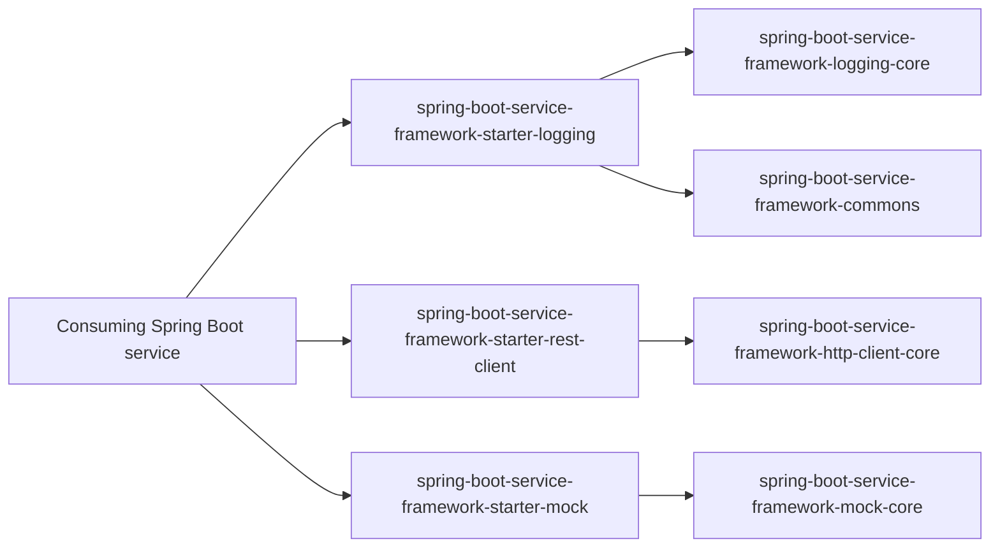

# Spring Boot Service Framework

Reusable Spring Boot framework modules for cross-cutting service capabilities on
Java 21.

This repository is a Gradle multi-module build. It currently provides:

- structured logging;
- framework-independent logging and HTTP client cores;
- configurable `RestClient` creation;
- mock response loading for development and testing;
- OAuth2 access token support;
- SSL/keystore handling;
- audit, observability, retry, and circuit-breaker support for outbound HTTP.

The project is designed as a private/internal framework first. It can be consumed
from local Maven repositories during development and later published to a private
Maven registry.

---

## Overview

The framework extracts common infrastructure concerns from Spring Boot services
into small, publishable modules.

Use it when a service needs shared behavior for:

- structured JSON logging;
- transaction/correlation IDs;
- typed outbound REST clients;
- reusable mock responses;
- client credentials and JWT bearer token acquisition;
- Apache HTTP Client tuning;
- JKS/PKCS12 SSL configuration;
- basic HTTP resilience policies.

Do not use it for application-specific domain logic. Business rules should stay
inside the consuming service.

---

## Architecture

The code follows a hexagonal architecture style. Core modules define domain
objects and ports. Starter modules adapt those ports to Spring Boot, SLF4J,
Logback, Apache HttpClient, Micrometer, and `RestClient`.



Dependency direction points inward. Core modules must not import Spring, SLF4J,
Logback, Servlet, Jackson, or Apache HttpClient APIs.

---

## Modules

| Module | Purpose | Main public API / docs |
|---|---|---|
| `spring-boot-service-framework-commons` | Framework-neutral utilities, notification model, notifying exceptions, marker/type enums, and temporary logging compatibility classes. | [spring-boot-service-framework-commons/README.md](spring-boot-service-framework-commons/README.md) |
| `spring-boot-service-framework-logging-core` | Immutable structured logging domain, application service, and ports. | [spring-boot-service-framework-logging-core/README.md](spring-boot-service-framework-logging-core/README.md) |
| `spring-boot-service-framework-http-client-core` | HTTP client domain, policies, token definitions, ports, notifications, and inspectable downstream exceptions without Spring dependencies. | [spring-boot-service-framework-http-client-core/README.md](spring-boot-service-framework-http-client-core/README.md) |
| `spring-boot-service-framework-mock-core` | Framework-neutral mock domain and exceptions, intended to evolve into a reusable mock responder core. | [spring-boot-service-framework-mock-core/README.md](spring-boot-service-framework-mock-core/README.md) |
| `spring-boot-service-framework-starters:spring-boot-service-framework-starter-logging` | Spring Boot starter for structured JSON logging, MDC correlation, servlet transaction filter, and Logback output. | [spring-boot-service-framework-starters/spring-boot-service-framework-starter-logging/README.md](spring-boot-service-framework-starters/spring-boot-service-framework-starter-logging/README.md) |
| `spring-boot-service-framework-starters:spring-boot-service-framework-starter-rest-client` | Spring Boot starter for configured `RestClient` beans, API client proxies, authentication, SSL, audit, observability, and optional resilience. | [docs/rest-client.md](docs/rest-client.md) |
| `spring-boot-service-framework-starters:spring-boot-service-framework-starter-mock` | Spring Boot starter for configured mock response loading from classpath or file resources. | [docs/mock.md](docs/mock.md) |

---

## Feature Map

| Feature | Use this module | Start here |
|---|---|---|
| Structured JSON logging in a Spring Boot service | `spring-boot-service-framework-starter-logging` | [Logging starter README](spring-boot-service-framework-starters/spring-boot-service-framework-starter-logging/README.md) |
| Framework-neutral logging model and ports | `spring-boot-service-framework-logging-core` | [Logging core README](spring-boot-service-framework-logging-core/README.md) |
| Named outbound `RestClient` beans and declarative HTTP APIs | `spring-boot-service-framework-starter-rest-client` | [REST client guide](docs/rest-client.md) |
| HTTP client domain model, policies, ports, and exceptions | `spring-boot-service-framework-http-client-core` | [HTTP client core README](spring-boot-service-framework-http-client-core/README.md) |
| Mock responses for controllers or outbound `RestClient` calls | `spring-boot-service-framework-starter-mock` | [Mock guide](docs/mock.md) |
| Framework-neutral mock responder contracts | `spring-boot-service-framework-mock-core` | [Mock core README](spring-boot-service-framework-mock-core/README.md) |
| Shared notifications and notifying exceptions | `spring-boot-service-framework-commons` | [Commons README](spring-boot-service-framework-commons/README.md) |
| Standalone consumer smoke tests | `examples/*` | [Logging example](examples/logging-consumer/README.md), [REST client example](examples/rest-client-consumer/README.md) |

---

## Requirements

| Requirement | Version / policy |
|---|---|
| Java | 21 |
| Gradle | Wrapper-provided Gradle, currently 9.3.1 in generated reports |
| Spring Boot | 4.1.0; controlled by `springBootVersion` in `gradle.properties` |
| Publishing | Local Maven repositories under each module `build/repository`; optional private Maven registry |

See [docs/compatibility.md](docs/compatibility.md) for the supported matrix.

---

## Installation

### Local Maven repository for development

Publish all artifacts into the user Maven local repository:

```bash
./gradlew publishToMavenLocal
```

Use them from a consuming service:

```groovy
repositories {
    mavenLocal()
    mavenCentral()
}

dependencies {
    implementation 'com.smbtech:spring-boot-service-framework-starter-logging:0.2.0'
    implementation 'com.smbtech:spring-boot-service-framework-starter-rest-client:0.2.0'
    implementation 'com.smbtech:spring-boot-service-framework-starter-mock:0.2.0'
}
```

### Local build repositories for smoke tests

Publish all framework artifacts into module-local repositories:

```bash
./gradlew publishLocalArtifacts
```

The standalone examples use these repositories instead of Gradle `project(...)`
dependencies.

### Composite build

During active framework development, a consuming service may use a Gradle
composite build:

```groovy
// settings.gradle in the consuming service
includeBuild('../spring-boot-service-framework')
```

---

## Quick start: structured logging

```groovy
dependencies {
    implementation 'com.smbtech:spring-boot-service-framework-starter-logging:0.2.0'
}
```

```java
import com.smbtech.serviceframework.logging.domain.EventType;
import com.smbtech.serviceframework.logging.domain.StructuredEvent;
import com.smbtech.serviceframework.logging.port.in.StructuredLogger;
import com.smbtech.serviceframework.logging.port.in.StructuredLoggerFactory;

final class ProjectService {
    private final StructuredLogger log;

    ProjectService(StructuredLoggerFactory factory) {
        this.log = factory.get(ProjectService.class);
    }

    void update(long projectId) {
        log.info(StructuredEvent.builder(EventType.AUDIT)
                .message("Project {} updated", projectId)
                .with("projectId", projectId)
                .tag("PROJECT")
                .build());
    }
}
```

## Quick start: REST client

```groovy
dependencies {
    implementation 'com.smbtech:spring-boot-service-framework-starter-rest-client:0.2.0'
}
```

```yaml
smbtech:
  rest-clients:
    clients:
      payments:
        base-url: https://payments.example
        default-headers:
          X-Application-Name: orders-service
```

The starter registers:

- a `RestClient` bean named `paymentsRestClient`;
- a `payments` entry in `RestClientRegistry`;
- a configured client available through `ApiClientFactory`.

Inject the generated bean directly:

```java
public PaymentsService(@Qualifier("paymentsRestClient") RestClient restClient) {
    this.restClient = restClient;
}
```

Or use a declarative Spring HTTP interface:

```java
@HttpApiClient("payments")
@HttpExchange
interface PaymentsApi {

    @GetExchange("/dummy")
    String dummy();
}
```

```java
PaymentsApi api = apiClientFactory.create(PaymentsApi.class);
```

See [docs/rest-client.md](docs/rest-client.md).

---

## REST client resilience example

```yaml
smbtech:
  rest-clients:
    clients:
      payments:
        base-url: https://payments.example
        resilience:
          enabled: true
          retry:
            enabled: true
            max-attempts: 3
            backoff: 100ms
            retry-on-statuses: [429]
          circuit-breaker:
            enabled: true
            failure-threshold: 3
            open-duration: 30s
```

Resilience is disabled by default.

---

## Verification

```bash
./gradlew clean check
./gradlew documentationCheck
./gradlew baseline
./gradlew consumerSmoke
./gradlew compatibilityCheck
```

`documentationCheck` validates relative Markdown links and scans example
documentation/configuration for accidentally committed secrets or encoded
keystore material.

`consumerSmoke` publishes artifacts only into temporary repositories under
`build/repository` and builds standalone consumers without Gradle `project(...)`
dependencies:

- [logging-consumer](examples/logging-consumer/README.md)
- [rest-client-consumer](examples/rest-client-consumer/README.md)

---

## Publishing to a private Maven registry

The build supports a private Maven registry without storing secrets in source
control:

```bash
export PRIVATE_MAVEN_URL=https://maven.example.com/releases
export PRIVATE_MAVEN_USERNAME=user
export PRIVATE_MAVEN_PASSWORD=secret

./gradlew :spring-boot-service-framework-starters:spring-boot-service-framework-starter-logging:publishAllPublicationsToPrivateRegistryRepository
./gradlew :spring-boot-service-framework-starters:spring-boot-service-framework-starter-rest-client:publishAllPublicationsToPrivateRegistryRepository
```

Equivalent Gradle properties are also supported:

```bash
./gradlew publish \
  -PprivateMavenUrl=https://maven.example.com/releases \
  -PprivateMavenUsername=user \
  -PprivateMavenPassword=secret
```

---

## Documentation map

| Document | Purpose |
|---|---|
| [PROVENANCE.md](PROVENANCE.md) | Source provenance and publication constraints. |
| [docs/compatibility.md](docs/compatibility.md) | Supported versions and compatibility policy. |
| [docs/rest-client.md](docs/rest-client.md) | Full REST client configuration and usage guide. |
| [docs/mock.md](docs/mock.md) | Mock core and starter usage guide. |
| [examples/logging-consumer/README.md](examples/logging-consumer/README.md) | Standalone logging starter consumer. |
| [examples/rest-client-consumer/README.md](examples/rest-client-consumer/README.md) | Standalone REST client starter consumer. |

---

## Troubleshooting

| Symptom | Check |
|---|---|
| Gradle cannot resolve the starter | Run `./gradlew publishToMavenLocal` or point the consuming build to the module `build/repository`. |
| `RestClient` bean is missing | Verify `smbtech.rest-clients.clients.<name>.base-url` and that the client is not disabled. |
| `@Qualifier` injection fails | Use the generated bean name `<clientName>RestClient`, or set `bean-name`. |
| OAuth token request fails | Check that `credential-token-requestor-id` matches a Spring OAuth2 registration, then verify token URI, grant type, client authentication method, credentials, signing keystore, and expected scopes. |
| SSL keystore fails to load | Check `type`, `location` or `base64`, `password-ref`, `key-alias`, and `key-password-ref`. |
| JWT bearer assertion is rejected | Verify signing key, `issuer`, `subject`, `audience`, `token-lifetime`, and provider-specific `custom-claims`. |

---

## Current status

The framework is in `0.2.0`. APIs can still evolve before `1.0.0`.
Private publication should happen only after ownership and provenance have been
confirmed for all included components.
