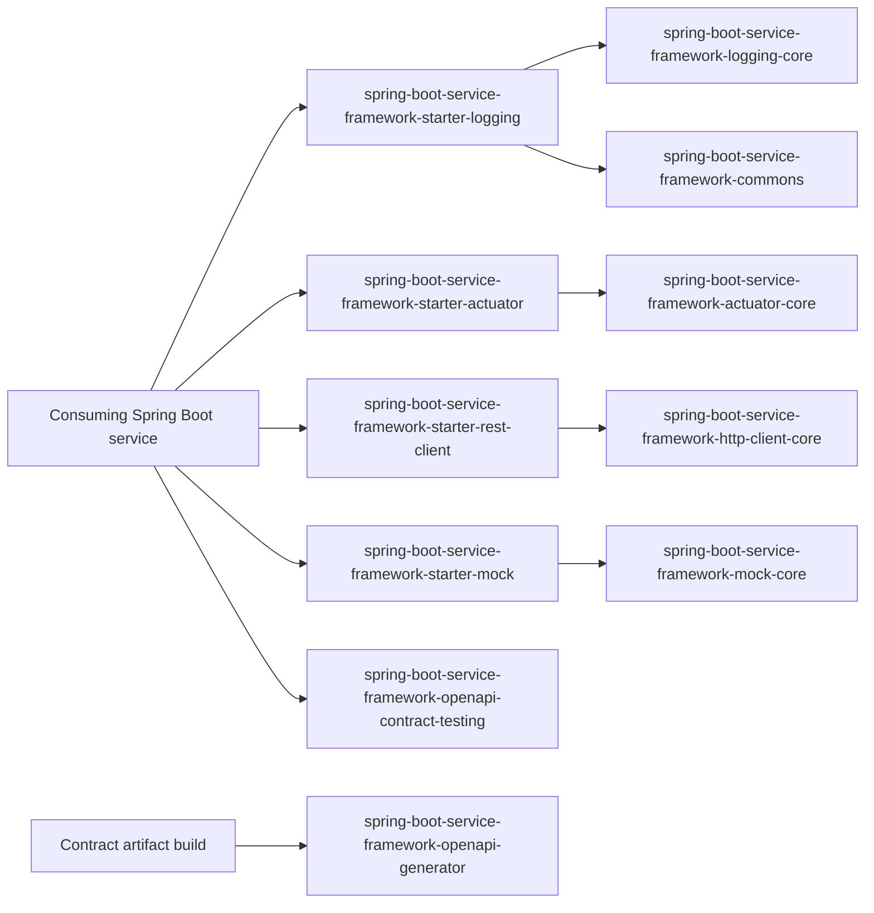

# Spring Boot Service Framework

Reusable Spring Boot framework modules for cross-cutting service capabilities on
Java 21.

This repository is a Gradle multi-module build. It currently provides:

- a dependency management platform for framework and Spring Boot versions;
- structured logging;
- framework-independent logging and HTTP client cores;
- configurable `RestClient` creation;
- mock response loading for development and testing;
- OAuth2 access token support;
- SSL/keystore handling;
- audit, observability, retry, and circuit-breaker support for outbound HTTP.
- Spring Boot AOT and GraalVM native-image support.

The project is designed as a private/internal framework first. It can be consumed
from local Maven repositories during development and later published to a private
Maven registry.

---

## Overview

The framework extracts common infrastructure concerns from Spring Boot services
into small, publishable modules.

Use it when a service needs shared behavior for:

- structured JSON logging;
- transaction/correlation IDs;
- typed outbound REST clients;
- reusable mock responses;
- executable OpenAPI contract tests for Spring MVC controllers;
- client credentials and JWT bearer token acquisition;
- OAuth2 REST client startup validation;
- request context propagation for dynamic outbound headers and JWT bearer claims;
- Apache HTTP Client tuning;
- JKS/PKCS12 SSL configuration;
- basic HTTP resilience policies.

Do not use it for application-specific domain logic. Business rules should stay
inside the consuming service.

---

## Architecture

The code follows a hexagonal architecture style. Core modules define domain
objects and ports. Starter modules adapt those ports to Spring Boot, SLF4J,
Logback, Apache HttpClient, Micrometer, and `RestClient`.



Dependency direction points inward. Core modules must not import Spring, SLF4J,
Logback, Servlet, Jackson, or Apache HttpClient APIs.

---

## Modules

| Module | Purpose | Main public API / docs |
|---|---|---|
| `spring-boot-service-framework-platform` | Gradle platform and Maven BOM that aligns all supported framework modules and imports the supported Spring Boot BOM. | [spring-boot-service-framework-platform/README.md](spring-boot-service-framework-platform/README.md), [Dependency Management](docs/dependency-management.md) |
| `spring-boot-service-framework-actuator-core` | Framework-neutral diagnostic domain, ports, bounded values, and deterministic aggregation. | [spring-boot-service-framework-actuator-core/README.md](spring-boot-service-framework-actuator-core/README.md), [Actuator Architecture Contract](docs/actuator.md), [Actuator Compatibility](docs/actuator/compatibility.md) |
| `spring-boot-service-framework-commons` | Framework-neutral notification model, severity values, and notifying exception contract. | [spring-boot-service-framework-commons/README.md](spring-boot-service-framework-commons/README.md) |
| `spring-boot-service-framework-logging-core` | Immutable structured logging domain, application service, and ports. | [spring-boot-service-framework-logging-core/README.md](spring-boot-service-framework-logging-core/README.md) |
| `spring-boot-service-framework-http-client-core` | HTTP client domain, policies, token definitions, ports, notifications, and inspectable downstream exceptions without Spring dependencies. | [spring-boot-service-framework-http-client-core/README.md](spring-boot-service-framework-http-client-core/README.md) |
| `spring-boot-service-framework-mock-core` | Framework-neutral mock domain and exceptions, intended to evolve into a reusable mock responder core. | [spring-boot-service-framework-mock-core/README.md](spring-boot-service-framework-mock-core/README.md) |
| `spring-boot-service-framework-error-core` | Framework-neutral error definitions, service exceptions, resolution policies, aggregation, and sanitization. | [spring-boot-service-framework-error-core/README.md](spring-boot-service-framework-error-core/README.md) |
| `spring-boot-service-framework-openapi-generator` | Build-time OpenAPI contract artifact generator boundary for generated models, server API, and REST client artifacts. | [spring-boot-service-framework-openapi-generator/README.md](spring-boot-service-framework-openapi-generator/README.md) |
| `spring-boot-service-framework-openapi-contract-testing` | Test-scope OpenAPI verification for Spring MVC status, media type, and JSON response contracts. | [spring-boot-service-framework-openapi-contract-testing/README.md](spring-boot-service-framework-openapi-contract-testing/README.md) |
| `spring-boot-service-framework-starters:spring-boot-service-framework-starter-actuator` | Spring Boot health, info, diagnostic endpoint, bounded metrics, and passive optional-starter integrations for neutral diagnostics. | [spring-boot-service-framework-starters/spring-boot-service-framework-starter-actuator/README.md](spring-boot-service-framework-starters/spring-boot-service-framework-starter-actuator/README.md), [Actuator Architecture Contract](docs/actuator.md), [Actuator Property Reference](docs/actuator/property-reference.md), [Actuator Compatibility](docs/actuator/compatibility.md) |
| `spring-boot-service-framework-starters:spring-boot-service-framework-starter-logging` | Spring Boot starter for structured JSON logging, MDC correlation, servlet transaction filter, and Logback output. | [spring-boot-service-framework-starters/spring-boot-service-framework-starter-logging/README.md](spring-boot-service-framework-starters/spring-boot-service-framework-starter-logging/README.md) |
| `spring-boot-service-framework-starters:spring-boot-service-framework-starter-rest-client` | Spring Boot starter for configured `RestClient` beans, API client proxies, authentication, SSL, audit, observability, and optional resilience. | [docs/rest-client.md](docs/rest-client.md) |
| `spring-boot-service-framework-starters:spring-boot-service-framework-starter-mock` | Spring Boot starter for configured mock response loading from classpath or file resources. | [docs/mock.md](docs/mock.md) |
| `spring-boot-service-framework-starters:spring-boot-service-framework-starter-error-handling` | Spring Boot starter for safe `Notification` responses across MVC, validation, downstream clients, and security. | [spring-boot-service-framework-starters/spring-boot-service-framework-starter-error-handling/README.md](spring-boot-service-framework-starters/spring-boot-service-framework-starter-error-handling/README.md) |
| `build-logic:conventions` | Internal Gradle conventions for Java libraries and Spring Boot starters. | [build-logic/conventions/README.md](build-logic/conventions/README.md) |

---

## Feature Map

| Feature | Use this module | Start here |
|---|---|---|
| Framework and Spring Boot dependency version alignment | `spring-boot-service-framework-platform` | [Dependency Management](docs/dependency-management.md) |
| Structured JSON logging in a Spring Boot service | `spring-boot-service-framework-starter-logging` | [Logging guide](docs/logging.md) |
| Framework-neutral logging model and ports | `spring-boot-service-framework-logging-core` | [Logging core README](spring-boot-service-framework-logging-core/README.md) |
| Named outbound `RestClient` beans and declarative HTTP APIs | `spring-boot-service-framework-starter-rest-client` | [REST client guide](docs/rest-client.md) |
| HTTP client domain model, policies, ports, and exceptions | `spring-boot-service-framework-http-client-core` | [HTTP client core README](spring-boot-service-framework-http-client-core/README.md) |
| Mock responses for controllers or outbound `RestClient` calls | `spring-boot-service-framework-starter-mock` | [Mock guide](docs/mock.md) |
| Safe MVC, validation, downstream, and security errors | `spring-boot-service-framework-starter-error-handling` | [Error Handling Guide](docs/error-handling.md) |
| Framework-neutral mock responder contracts | `spring-boot-service-framework-mock-core` | [Mock core README](spring-boot-service-framework-mock-core/README.md) |
| OpenAPI contract artifact generation | `spring-boot-service-framework-openapi-generator` | [OpenAPI generator README](spring-boot-service-framework-openapi-generator/README.md) |
| OpenAPI breaking change detection and SemVer enforcement | `spring-boot-service-framework-openapi-generator` | [OpenAPI Breaking Change Detection](docs/openapi-breaking-changes.md) |
| OpenAPI contract testing for Spring MVC controllers | `spring-boot-service-framework-openapi-contract-testing` | [OpenAPI Contract Testing](docs/openapi-contract-testing.md) |
| Shared notifications and notifying exceptions | `spring-boot-service-framework-commons` | [Commons README](spring-boot-service-framework-commons/README.md) |
| Reusable MVC and security error responses | `spring-boot-service-framework-starter-error-handling` | [Error handling example](examples/error-handling-consumer/README.md) |
| Standalone consumer smoke tests | `examples/*` | [Actuator example](examples/actuator-consumer/README.md), [Error handling example](examples/error-handling-consumer/README.md), [Logging example](examples/logging-consumer/README.md), [REST client example](examples/rest-client-consumer/README.md) |
| Private quality-platform pilot | `examples/quality-pilot` | [Quality pipeline](docs/quality-pipeline.md), [Quality pilot](examples/quality-pilot/README.md) |
| Spring Boot AOT and GraalVM native-image | all runtime starters | [Native image guide](docs/native-image.md) |

---

## Requirements

| Requirement | Version / policy |
|---|---|
| Java | 21 |
| Gradle | Wrapper-provided Gradle, currently 9.3.1 in generated reports |
| Spring Boot | 4.1.0; controlled by `springBootVersion` in `gradle.properties` |
| Jackson | 3.1.x through Spring Boot dependency management |
| Native Image | GraalVM 25+ with Native Build Tools 1.1.1 |
| Publishing | Local Maven repositories under each module `build/repository`; optional private Maven registry |

See [docs/compatibility.md](docs/compatibility.md) for the supported matrix.

---

## Installation

### Local Maven repository for development

Publish all artifacts into the user Maven local repository:

```bash
./gradlew publishToMavenLocal
```

Use them from a consuming service:

```groovy
repositories {
    mavenLocal()
    mavenCentral()
}

dependencies {
    implementation platform(
            'com.smbtech:spring-boot-service-framework-platform:0.4.0'
    )
    implementation 'com.smbtech:spring-boot-service-framework-starter-logging'
    implementation 'com.smbtech:spring-boot-service-framework-starter-rest-client'
    implementation 'com.smbtech:spring-boot-service-framework-starter-mock'
    implementation 'com.smbtech:spring-boot-service-framework-starter-error-handling'
}
```

See [Dependency Management](docs/dependency-management.md) for Gradle, Maven,
local publication, and private registry examples.

### Local build repositories for smoke tests

Publish all framework artifacts into module-local repositories:

```bash
./gradlew publishLocalArtifacts
```

The standalone examples use these repositories instead of Gradle `project(...)`
dependencies. This command also publishes generated OpenAPI artifacts under
`build/repository/openapi`.

### Composite build

During active framework development, a consuming service may use a Gradle
composite build:

```groovy
// settings.gradle in the consuming service
includeBuild('../spring-boot-service-framework')
```

---

## Quick start: structured logging

```groovy
dependencies {
    implementation platform(
            'com.smbtech:spring-boot-service-framework-platform:0.4.0'
    )
    implementation 'com.smbtech:spring-boot-service-framework-starter-logging'
}
```

```java
import com.smbtech.serviceframework.logging.domain.EventType;
import com.smbtech.serviceframework.logging.domain.StructuredEvent;
import com.smbtech.serviceframework.logging.port.in.StructuredLogger;
import com.smbtech.serviceframework.logging.port.in.StructuredLoggerFactory;

final class ProjectService {
    private final StructuredLogger log;

    ProjectService(StructuredLoggerFactory factory) {
        this.log = factory.get(ProjectService.class);
    }

    void update(long projectId) {
        log.info(StructuredEvent.builder(EventType.AUDIT)
                .message("Project {} updated", projectId)
                .with("projectId", projectId)
                .tag("PROJECT")
                .build());
    }
}
```

## Quick start: REST client

```groovy
dependencies {
    implementation platform(
            'com.smbtech:spring-boot-service-framework-platform:0.4.0'
    )
    implementation 'com.smbtech:spring-boot-service-framework-starter-rest-client'
}
```

Add `org.springframework.boot:spring-boot-starter-oauth2-client` explicitly when
using `CLIENT_CREDENTIALS`, `JWT_BEARER`, or `AccessTokenClient`.

```yaml
smbtech:
  rest-clients:
    clients:
      payments:
        base-url: https://payments.example
        default-headers:
          X-Application-Name: orders-service
```

The starter registers:

- a `RestClient` bean named `paymentsRestClient`;
- a `payments` entry in `RestClientRegistry`;
- a configured client available through `ApiClientFactory`.

Inject the generated bean directly:

```java
public PaymentsService(@Qualifier("paymentsRestClient") RestClient restClient) {
    this.restClient = restClient;
}
```

Or use a declarative Spring HTTP interface:

```java
@HttpApiClient("payments")
@HttpExchange
interface PaymentsApi {

    @GetExchange("/dummy")
    String dummy();
}
```

```java
PaymentsApi api = apiClientFactory.create(PaymentsApi.class);
```

See [docs/rest-client.md](docs/rest-client.md).

---

## REST client resilience example

```yaml
smbtech:
  rest-clients:
    clients:
      payments:
        base-url: https://payments.example
        resilience:
          enabled: true
          retry:
            enabled: true
            max-attempts: 3
            backoff: 100ms
            retry-on-statuses: [429]
          circuit-breaker:
            enabled: true
            failure-threshold: 3
            open-duration: 30s
```

Resilience is disabled by default.

---

## Verification

```bash
./gradlew clean check
./gradlew codeQualityCheck
./gradlew documentationCheck
./gradlew baseline
./gradlew sonar
./gradlew openApiBreakingChangeCheck
./gradlew openApiCompatibilityCheck
./gradlew moduleCompatibilityCheck
./gradlew platformCompatibilityCheck
./gradlew actuatorContractCheck
./gradlew actuatorCompatibilityCheck
./gradlew consumerSmoke
./gradlew compatibilityCheck
```

`codeQualityCheck` validates formatting, public API Javadocs, public package
documentation, prohibited legacy identifiers, and commented-out Java code.

`documentationCheck` validates Markdown structure, relative links and anchors,
canonical documentation coverage, changelog/release docs, framework version
references, OpenAPI name normalization and `info.title`/`info.version`,
OpenAPI spec version catalog, OpenAPI breaking change detection, generated
OpenAPI metadata, models JARs, server API JARs, client JARs, advanced OpenAPI model generation, OpenAPI artifact
separation, reproducible OpenAPI generation, generated OpenAPI compilation
tests, generated property references, and example documentation/configuration
for accidentally committed secrets or encoded keystore material.

`openApiCompatibilityCheck` validates the generated OpenAPI artifact contract,
including spec naming, metadata, version catalog entries, breaking change
detection, JAR contents, advanced model generation, artifact separation, reproducibility, consumer-style
compilation, reusable generator module checks, build-logic checks, and local
Maven publication.

`moduleCompatibilityCheck` validates the reviewed public API, extension points,
configuration properties, auto-configuration imports, plugin ids, and module
behavior for Commons, Logging, HTTP Client, Mock, OpenAPI Generator, Contract
Testing, Actuator, and the OpenAPI Gradle plugin.

`platformCompatibilityCheck` validates the managed framework constraints, the
imported Spring Boot BOM, published Maven metadata, and the committed platform
compatibility contract.

`actuatorContractCheck` validates the Actuator core and starter
boundaries, passive health policy, management ownership, safe runtime names, and
forbidden framework-neutral core dependencies.

`actuatorCompatibilityCheck` additionally protects the neutral method-level
API, runtime names, endpoint and metric contracts, documentation, and the
published Actuator consumer HTTP and AOT behavior.

`consumerSmoke` publishes artifacts only into temporary repositories under
`build/repository` and builds standalone consumers without Gradle `project(...)`
dependencies. Each consumer imports the framework platform and declares its
framework modules without individual versions:

- [actuator-consumer](examples/actuator-consumer/README.md)
- [logging-consumer](examples/logging-consumer/README.md)
- [rest-client-consumer](examples/rest-client-consumer/README.md)
- [error-handling-consumer](examples/error-handling-consumer/README.md)

`sonar` depends on `baseline` and imports the JaCoCo XML report from every
framework module. Configure `SONAR_HOST_URL`, `SONAR_TOKEN`, and optionally
`SONAR_PROJECT_KEY` outside source control.

Run the focused error handling API and consumer compatibility contract with:

```bash
./gradlew errorHandlingCompatibilityCheck
```

The root `check` task includes compatibility and supply-chain verification so
the catalog-managed Jenkins pipeline exercises the complete framework quality
contract. `releaseGate` additionally provides the explicit pre-publication
lifecycle. These tasks enforce a 50% minimum line coverage per published module,
validate Maven POM metadata and reproducible archives, and generate aggregate
CycloneDX JSON and XML SBOMs under `build/reports`. Run
`./gradlew dependencyTrackSbom` to generate and validate the production-only
SBOM used by Dependency-Track.

---

## Publishing to a private Maven registry

The build supports a private Maven registry without storing secrets in source
control:

```bash
export PRIVATE_MAVEN_URL=https://maven.example.com/releases
export PRIVATE_MAVEN_USERNAME=user
export PRIVATE_MAVEN_PASSWORD=secret
export SIGNING_KEY="$(cat release-signing-key.asc)"
export SIGNING_PASSWORD=secret

./gradlew publish -PreleaseBuild=true
```

Remote publication is accepted only from the matching signed Git tag. The
canonical process is the tag-triggered workflow documented in
[docs/releasing.md](docs/releasing.md).

---

## Documentation map

| Document | Purpose |
|---|---|
| [docs/index.md](docs/index.md) | Main documentation index by reader need, feature area, module, example, and maintainer task. |
| [docs/actuator.md](docs/actuator.md) | Reviewed Actuator architecture, auto-configuration, safety, ownership, and information-exposure contract. |
| [docs/actuator/compatibility.md](docs/actuator/compatibility.md) | Supported Actuator API, runtime names, payload, change policy, and focused compatibility lifecycle. |
| [docs/actuator/property-reference.md](docs/actuator/property-reference.md) | Generated Service Framework Actuator configuration reference. |
| [docs/dependency-management.md](docs/dependency-management.md) | Framework BOM usage with Gradle and Maven, managed modules, publication, and conflict troubleshooting. |
| [CHANGELOG.md](CHANGELOG.md) | Release history and notable project changes. |
| [PROVENANCE.md](PROVENANCE.md) | Source provenance and publication constraints. |
| [docs/documentation-architecture.md](docs/documentation-architecture.md) | Documentation ownership rules, canonical sources, and anti-duplication policy. |
| [docs/code-conventions.md](docs/code-conventions.md) | Java naming, acronym, package, Javadoc, exception, default implementation, and auto-configuration conventions. |
| [docs/public-api-boundaries.md](docs/public-api-boundaries.md) | Supported package convention, implementation boundaries, and documented package/type exceptions. |
| [docs/module-readme-convention.md](docs/module-readme-convention.md) | Required structure and validation rules for module READMEs. |
| [docs/public-api-inventory.md](docs/public-api-inventory.md) | Generated artifact catalog of public packages, extension points, properties, exceptions, and public internal types. |
| [docs/compatibility.md](docs/compatibility.md) | Supported versions and compatibility policy. |
| [docs/releasing.md](docs/releasing.md) | Release checklist, versioning, tagging, and private publication process. |
| [docs/openapi-codegen.md](docs/openapi-codegen.md) | OpenAPI code generation coordinate convention and planned artifact layout. |
| [docs/openapi-breaking-changes.md](docs/openapi-breaking-changes.md) | OpenAPI baseline snapshots, structural change classification, and SemVer enforcement. |
| [docs/openapi-evolution.md](docs/openapi-evolution.md) | OpenAPI generator post-split evolution roadmap, ownership stages, and compatibility rules. |
| [docs/openapi-contract-testing.md](docs/openapi-contract-testing.md) | Executable Spring MVC response verification against OpenAPI contracts. |
| [docs/guides/openapi-generated-artifacts.md](docs/guides/openapi-generated-artifacts.md) | Copy-oriented OpenAPI generation, validation, publication, and consumption workflow. |
| [gradle/documentation-checks.gradle](gradle/documentation-checks.gradle) | Repository documentation, example safety, and documentation aggregate validation tasks. |
| [gradle/public-api-inventory.gradle](gradle/public-api-inventory.gradle) | Public boundary inventory, package classification, drift detection, and marker validation tasks. |
| [gradle/lifecycle.gradle](gradle/lifecycle.gradle) | Root lifecycle tasks such as `baseline`, `publishLocalArtifacts`, `consumerSmoke`, `errorHandlingCompatibilityCheck`, and `compatibilityCheck`. |
| [build-logic/openapi-generator-plugin/README.md](build-logic/openapi-generator-plugin/README.md) | OpenAPI Gradle plugin, DSL, generation tasks, task wiring, and publication wiring. |
| [build-logic/conventions/README.md](build-logic/conventions/README.md) | Java library and Spring Boot starter build conventions. |
| [docs/logging.md](docs/logging.md) | Structured logging, MDC, transaction id propagation, configuration, and logging core boundaries. |
| [docs/logging/compatibility.md](docs/logging/compatibility.md) | Supported logging API, properties, runtime names, Logback fragments, and compatibility rules. |
| [docs/logging/async-appender.md](docs/logging/async-appender.md) | Async logging topology, queue policy, critical-event limitations, operational limits, and baseline measurement. |
| [docs/rest-client.md](docs/rest-client.md) | REST client documentation entry point and topic map. |
| [docs/rest-client-extension-points.md](docs/rest-client-extension-points.md) | Public REST client extension contract, replacement points, customizers, and internal package boundaries. |
| [docs/error-handling.md](docs/error-handling.md) | Error catalogs, resolution pipeline, status mapping, validation, downstream failures, security, and sanitization. |
| [docs/error-handling/security.md](docs/error-handling/security.md) | Spring Security error catalog, OAuth2 metadata, RFC 6750 challenges, required scopes, and replacement points. |
| [docs/error-handling/json-contract.md](docs/error-handling/json-contract.md) | Stable snake-case `Notification` HTTP response contract. |
| [docs/error-handling/property-reference.md](docs/error-handling/property-reference.md) | Generated error handling configuration reference. |
| [docs/error-handling-extension-points.md](docs/error-handling-extension-points.md) | Public error handling policies, customizers, reporters, serializers, and replacement points. |
| [docs/guides/migrate-shared-exception.md](docs/guides/migrate-shared-exception.md) | Migration from copied `shared/exception` classes and handlers. |
| [docs/guides/migrate-public-names-and-properties.md](docs/guides/migrate-public-names-and-properties.md) | Migration for renamed Java types, packages, and configuration properties. |
| [docs/mock.md](docs/mock.md) | Mock core and starter usage guide. |
| [docs/troubleshooting.md](docs/troubleshooting.md) | Troubleshooting catalog for Gradle, REST client, OAuth2, SSL, cache, diagnostics, mock, and logging issues. |
| [examples/logging-consumer/README.md](examples/logging-consumer/README.md) | Standalone logging starter consumer. |
| [examples/rest-client-consumer/README.md](examples/rest-client-consumer/README.md) | Standalone REST client starter consumer. |
| [examples/error-handling-consumer/README.md](examples/error-handling-consumer/README.md) | Standalone error handling starter consumer. |
| [examples/actuator-consumer/README.md](examples/actuator-consumer/README.md) | Standalone Actuator starter consumer with application-owned endpoint security. |

---

## Troubleshooting

Use [docs/troubleshooting.md](docs/troubleshooting.md) for Gradle,
publication, REST client creation, OAuth2, SSL, token cache, request context,
diagnostics, error handling, mock, and logging issues.

---

## Current status

The framework is in `0.4.0`. APIs can still evolve before `1.0.0`.
Private publication should happen only after ownership and provenance have been
confirmed for all included components.
