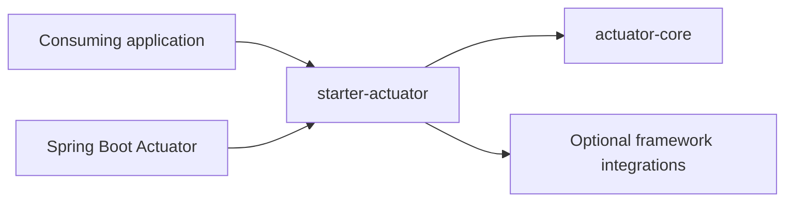

# Actuator Architecture Contract

This document defines the reviewed architecture and safety boundaries for the
Spring Boot Service Framework Actuator modules. Both module boundaries and the
framework-neutral core API are available. Spring Boot auto-configuration is
available for health, application information, diagnostics, and metrics.

## Target Modules

The capability is split into:

- `spring-boot-service-framework-actuator-core`: framework-neutral diagnostic
  domain, ports, and aggregation services;
- `spring-boot-service-framework-starter-actuator`: Spring Boot Actuator,
  Micrometer, auto-configuration, and optional framework-module adapters.

The core must remain usable without Spring Boot. Spring-specific health, info,
endpoint, management, and metrics APIs belong only in the starter.

## Dependency Direction



The core must not import Spring, Micrometer, SLF4J, Servlet, Jackson, or Apache
HttpClient APIs. Optional integrations must be isolated in starter
auto-configurations and must not make other framework starters transitive
runtime dependencies.

## Runtime Names

The stable runtime naming contract is:

| Concern | Contract |
|---|---|
| Framework property prefix | `smbtech.actuator` |
| Base auto-configuration toggle | `smbtech.actuator.enabled` (`true`) |
| Health contributor name | `serviceFramework` |
| Info response key | `serviceFramework` |
| Diagnostic endpoint id | `serviceframework` |
| Diagnostic endpoint default access | `Access.NONE` |

The diagnostic endpoint will use Spring Boot's endpoint infrastructure. It must
not be implemented as an MVC or WebFlux controller.

## Base Auto-Configuration

`com.smbtech.serviceframework.starter.actuator.autoconfigure.ActuatorAutoConfiguration`
is discovered through Spring Boot's `AutoConfiguration.imports` mechanism when
Spring Boot health infrastructure is available and `smbtech.actuator.enabled`
is `true` or absent.

It creates one `FrameworkDiagnostics` bean using the default aggregator exposed
by `FrameworkDiagnostics.from(...)`. All application `DiagnosticProbe` and
`FrameworkModuleInfoProvider` beans are collected through their neutral ports.
If the application publishes a unique `Clock`, it timestamps snapshots;
otherwise the service uses a UTC system clock without registering a global
framework `Clock` bean.

The auto-configuration backs off when the application provides its own
`FrameworkDiagnostics`. Setting `smbtech.actuator.enabled=false` disables this
base assembly.

## Health Indicator

`com.smbtech.serviceframework.starter.actuator.autoconfigure.ActuatorHealthAutoConfiguration`
registers a bean named `serviceFrameworkHealthIndicator`, backed by
an internal Spring Boot `HealthIndicator` adapter.
Spring Boot exposes its contributor name as `serviceFramework`.

Neutral statuses map without custom values:

| Neutral status | Spring Boot status |
|---|---|
| `UP` | `UP` |
| `DOWN` | `DOWN` |
| `OUT_OF_SERVICE` | `OUT_OF_SERVICE` |
| `UNKNOWN` | `UNKNOWN` |

The health result contains the snapshot capture time, component count, and
deterministically ordered component statuses and sanitized details. A missing
snapshot or runtime diagnostics failure becomes `UNKNOWN` with a static reason;
exception types, messages, causes, and stack traces are never copied.

The indicator follows Spring Boot's standard
`management.health.service-framework.enabled` switch and
`management.health.defaults.enabled`. An explicitly enabled contributor
overrides a disabled default. The application can replace the framework
indicator by publishing a bean named `serviceFrameworkHealthIndicator`.

Endpoint access, detail visibility, HTTP status mappings, security, exposure,
and health groups remain owned by Spring Boot `management.*` configuration and
the consuming application. The starter does not add the contributor to
liveness or readiness.

## Application Information

`com.smbtech.serviceframework.starter.actuator.autoconfigure.ActuatorInfoAutoConfiguration`
registers a bean named `serviceFrameworkInfoContributor`, backed by
an internal Spring Boot `InfoContributor` adapter.
It contributes bounded module information under the `serviceFramework` key of
the standard Spring Boot info response.

The payload contains availability, module count, module name, version, and
sanitized attributes. A missing result or runtime diagnostics failure produces
a static unavailable reason and never includes exception messages, types,
causes, or stack traces.

The contributor follows Spring Boot's
`management.info.service-framework.enabled` switch and
`management.info.defaults.enabled`. The application can replace it by
publishing a bean named `serviceFrameworkInfoContributor`.

## Diagnostic Endpoint

`com.smbtech.serviceframework.starter.actuator.autoconfigure.ActuatorEndpointAutoConfiguration`
registers
the internal bean named `serviceFrameworkDiagnosticsEndpoint`
only when Spring Boot considers the endpoint available. The endpoint id is
`serviceframework`; it has one `@ReadOperation` and defaults to `Access.NONE`.
Its response contains the aggregate status, capture time, bounded component
details, and bounded module information.

Both access and exposure must be enabled explicitly:

```yaml
management:
  endpoint:
    serviceframework:
      access: read-only
  endpoints:
    web:
      exposure:
        include: health,info,serviceframework
```

This exposes the endpoint at `/actuator/serviceframework` when the default
Actuator base path is used. The application remains responsible for securing
that path. Setting only `management.endpoint.serviceframework.access` does not
expose it over HTTP; `management.endpoints.web.exposure.include` is also
required.

## Optional Starter Integrations

`com.smbtech.serviceframework.starter.actuator.autoconfigure.ActuatorIntegrationsAutoConfiguration`
detects optional framework starter beans and registers passive adapters. The
optional starters remain `compileOnly` dependencies of the Actuator starter and
are not published as transitive dependencies.

| Starter | Registered bean | Output |
|---|---|---|
| `rest-client` | `serviceFrameworkRestClientDiagnosticProbe` | Passive `rest-client` health component with configured, enabled, registered, resilience-enabled, and circuit-breaker-enabled client counts. |
| `rest-client` | `serviceFrameworkRestClientModuleInfoProvider` | Module version and the same bounded client counts. |
| `mock` | `serviceFrameworkMockModuleInfoProvider` | Module version and configured/enabled endpoint and OpenAPI contract counts. |
| `logging` | `serviceFrameworkLoggingModuleInfoProvider` | Module version and bounded logging feature state. |
| `error-handling` | `serviceFrameworkErrorHandlingModuleInfoProvider` | Module version, response exposure, and bounded feature state. |

The REST client probe reads configuration and `RestClientRegistry.names()`
only. It never constructs a client and never sends an HTTP request. Mock
integration never loads response bodies or OpenAPI resources. No integration
exposes client names, bean names, URLs, headers, credentials, scopes, mock
paths, response bodies, metric names, or exception details.

Published framework JARs include `Implementation-Version`, which the module
information providers use as their version. Classes executed directly from a
development build use `development`.

Every integration bean backs off by its stable bean name. An application can
replace one adapter without disabling the remaining integrations. Setting
`smbtech.actuator.enabled=false` disables all integration adapters.

## Metrics

`com.smbtech.serviceframework.starter.actuator.autoconfigure.ActuatorMetricsAutoConfiguration`
registers a bean named `serviceFrameworkMetrics`, backed by
an internal Micrometer `MeterBinder`,
when a `MeterRegistry` and `FrameworkDiagnostics` are available. The
auto-configuration backs off when the application provides a bean with that
name.

The binder publishes only fixed, bounded dimensions:

| Metric | Tags | Semantics |
|---|---|---|
| `smbtech.service.framework.status` | `status=up|down|out_of_service|unknown` | One-hot aggregate status. The current status is `1`; the other status series are `0`. |
| `smbtech.service.framework.components` | `status=up|down|out_of_service|unknown` | Number of diagnostic components in each status. |
| `smbtech.service.framework.modules` | None | Number of detected framework modules. |

Component names, module names, client names, URLs, exception data, and detail
values are never metric tags. Diagnostic failures produce an `unknown`
aggregate status and zero counts without exposing failure details.

Metrics are enabled by default. One diagnostics sample is reused across all
gauge reads for 10 seconds:

```yaml
smbtech:
  actuator:
    metrics:
      enabled: true
      cache-ttl: 10s
```

`smbtech.actuator.metrics.enabled=false` disables only the framework metrics
binder. `smbtech.actuator.metrics.cache-ttl=0` refreshes the sample for every
gauge read. A negative cache duration is rejected.

Micrometer calls the neutral diagnostics service when a sample expires.
Framework-provided integrations are passive, but an application-provided
`DiagnosticProbe` may perform work. Applications own the cost and timeout
policy of those custom probes.

Spring Boot `management.*` configuration owns metrics endpoint and exporter
exposure. For example, the standard metrics endpoint can be exposed explicitly:

```yaml
management:
  endpoints:
    web:
      exposure:
        include: health,info,metrics
```

Metrics exporters, including Prometheus registries, remain selected by the
consuming application.

## Security And Performance Guard

The default diagnostics bean is wrapped by an internal safety and performance
guard.
The guard protects health, info, the custom endpoint, and metrics readers with
the same bounded results.

Its defaults are:

| Property | Default | Purpose |
|---|---:|---|
| `smbtech.actuator.diagnostics.cache-ttl` | `5s` | Shares one snapshot and one module result across concurrent readers. `0` disables shared caching. |
| `smbtech.actuator.diagnostics.operation-timeout` | `2s` | Limits one complete snapshot or module-information operation. It must be positive. |
| `smbtech.actuator.diagnostics.max-components` | `64` | Limits retained component results. Accepted values are `1` through `256`. |
| `smbtech.actuator.diagnostics.max-modules` | `64` | Limits retained module results. Accepted values are `1` through `256`. |

```yaml
smbtech:
  actuator:
    diagnostics:
      cache-ttl: 5s
      operation-timeout: 2s
      max-components: 64
      max-modules: 64
```

Snapshot and module refreshes are independently single-flight. Execution uses
at most two daemon workers and has no task queue. Saturation, timeout,
interruption, invalid output, or delegate failure becomes a bounded result with
a static reason. Exception types, messages, causes, and stack traces are never
copied. Safe fallback results are cached too, preventing repeated failing or
timed-out work during a scrape storm.

When component truncation is required, the guard retains a component carrying
the original aggregate worst status so the health result cannot become more
optimistic because of the limit. Module and component values remain immutable
and secret-sanitized by the neutral domain.

An application-provided `FrameworkDiagnostics` bean replaces the complete
framework default, including this guard. Such a replacement owns its execution
timeouts, concurrency, payload bounds, caching, and sanitization contract.

## Health Policy

The neutral core status model is limited to:

- `UP`;
- `DOWN`;
- `OUT_OF_SERVICE`;
- `UNKNOWN`.

The first version will not introduce a custom `DEGRADED` status because that
would require an application-wide Spring Boot status aggregation and HTTP
mapping policy.

Health evaluation must follow these rules:

- no active external HTTP, OAuth2, database, or broker call runs by default;
- contributor failures are converted into an inspectable health result instead
  of escaping from the health endpoint;
- details are immutable, bounded, and sanitized before reaching an adapter;
- contributor output ordering is deterministic;
- the default Spring adapter enforces shared timeouts, caching, concurrency, and
  payload bounds;
- no contributor is added automatically to `liveness`, `readiness`, or a custom
  health group.

The consuming application decides whether a passive framework contributor is
appropriate for readiness. Liveness must not depend on external systems.

## Endpoint And Security Ownership

Spring Boot `management.*` properties own endpoint access, exposure, base path,
detail visibility, health groups, and management ports. The starter must not
set or override those properties.

The consuming application owns Actuator authentication and authorization. The
starter must not create a `SecurityFilterChain`, authentication mechanism, or
authorization policy.

The diagnostic endpoint is read-only and has `Access.NONE` by default. Enabling
`management.endpoint.serviceframework.access` still requires explicit Spring
Boot endpoint exposure and application security configuration.

## Information Exposure

Actuator output must never contain:

- access tokens, JWT assertions, authorization headers, cookies, or API keys;
- client secrets, passwords, password references, private keys, or keystore
  content;
- complete application properties or environment variables;
- mock response bodies;
- exception stack traces or raw exception causes;
- unbounded or cyclic values.

REST client integration is passive. It exposes bounded configuration and
registration counts, but it must not expose
credentials, headers, scopes, internal URLs, or response bodies.

Mock integration exposes bounded counts, but not mock content or resource
locations. Logging and error handling module presence belongs in application
information unless a meaningful runtime health probe is introduced.

## Extension Boundary

Application-specific checks will implement a framework-neutral diagnostic probe
port from `actuator-core`. They must not need Spring Boot Actuator types.

The starter adapts neutral results to Spring Boot health, info, and endpoint
APIs.
Application-provided core services, probes, contributors, and adapter beans must
replace framework defaults through normal Spring Boot backoff behavior.
Concrete starter adapters are implementation details and are not supported
injection or construction contracts.

## Standalone Consumer Example

The published-artifact example lives in
[`examples/actuator-consumer`](../examples/actuator-consumer/README.md). It
registers an application `DiagnosticProbe` and `FrameworkModuleInfoProvider`,
owns the `SecurityFilterChain`, and exposes a public dummy endpoint.

Run the complete HTTP and AOT smoke test from the repository root:

```bash
./gradlew actuatorConsumerSmoke
```

The test starts a real embedded server and verifies public health and info,
role-protected diagnostics and metrics, authorized health details, application
extension discovery, bounded metric availability, and sensitive-value
redaction.

### Neutral Core API

The supported core contracts are:

| Type | Role |
|---|---|
| `ComponentStatus` | Framework-neutral health status and severity aggregation. |
| `ComponentHealth` | Immutable result from one component probe. |
| `FrameworkDiagnosticsSnapshot` | Timestamped, deterministically ordered aggregate. |
| `FrameworkModuleInfo` | Bounded, non-sensitive module information. |
| `FrameworkDiagnostics` | Inbound diagnostics use case. |
| `DiagnosticProbe` | Outbound component diagnostic extension port. |
| `FrameworkModuleInfoProvider` | Outbound module information extension port. |

The implementation returned by `FrameworkDiagnostics.from(...)` is internal
framework infrastructure. It executes probes in component-name order, converts
runtime probe failures to `UNKNOWN`, and never copies exception messages or
types into the result. Invalid module information providers are omitted from
the information result.

Core detail values are recursively immutable and bounded to eight nested
levels, 64 entries per container, and 2,048 characters per string. Cycles and
arbitrary object values are rejected. Sensitive keys, including credentials,
tokens, secrets, scopes, authorization, cookies, keystores, truststores, URLs,
and URIs, are replaced with `[REDACTED]`.

## Compatibility

The supported neutral API, properties, stable runtime names, diagnostic payload
fields, compatible change rules, and focused validation workflow are defined in
[Actuator Compatibility](actuator/compatibility.md).

Run the complete Actuator compatibility lifecycle with:

```bash
./gradlew actuatorCompatibilityCheck
```

## Contract Validation

Run:

```bash
./gradlew actuatorContractCheck
```

The check validates:

- target coordinates and runtime names;
- standard status values;
- endpoint access, security, exposure, and health-group ownership;
- the passive external-check policy;
- required documentation coverage;
- required neutral core API types and forbidden core dependencies;
- the base auto-configuration import and default activation policy;
- neutral-to-Spring health status mapping and standard contributor enablement;
- info contributor naming, standard enablement, and safe failure behavior;
- read-only diagnostic endpoint access and explicit exposure requirements;
- passive optional starter integration and dependency-isolation rules;
- bounded-cardinality Micrometer metrics, cache configuration, and backoff;
- bounded diagnostics execution, timeouts, single-flight caching, and safe
  failure behavior;
- the `examples/actuator-consumer` published-artifact application and
  `actuatorConsumerSmoke` lifecycle task;
- forbidden controller and security ownership in the starter.

The same contract check is part of the repository baseline.
