# Error Handling

The error handling starter provides one safe `Notification` response contract
for application exceptions, Spring MVC failures, Bean Validation, downstream
HTTP client errors, unexpected failures, and Spring Security 401/403 responses.

## Dependency

```groovy
dependencies {
    implementation platform(
            'com.smbtech:spring-boot-service-framework-platform:0.5.1'
    )
    implementation 'com.smbtech:spring-boot-service-framework-starter-error-handling'
}
```

The starter exposes `error-core` and the shared notification types transitively.
Add `spring-boot-service-framework-http-client-core` when the application also
throws `HttpClientResponseException`.

Use the [exception selection guide](error-handling/exception-selection.md) to
choose between application, configuration, authentication, mock, and downstream
exceptions.

## Minimal Configuration

```yaml
smbtech:
  error-handling:
    enabled: true
    response:
      exposure: PUBLIC
      include-field-violations: true
      metadata-allowlist:
        - correlationId
        - path
        - violations
    security:
      enabled: true
```

See the generated [property reference](error-handling/property-reference.md)
for every option and default.

## Response Exposure

`smbtech.error-handling.response.exposure` is a global policy. It is applied
after every resolver and `ResolvedErrorCustomizer`, so the selected value
controls application errors, MVC and validation failures, downstream failures,
Spring Security errors, and unexpected exceptions.

Use the default `PUBLIC` mode for untrusted or external consumers. It preserves
the stable error code while returning a generic message and minimal metadata:

```yaml
smbtech:
  error-handling:
    response:
      exposure: PUBLIC
```

```json
{
  "code": "E_ORDER_0001",
  "message": "The request could not be completed",
  "severity": "ERROR",
  "field_name": "",
  "metadata": {
    "category": "NOT_FOUND"
  }
}
```

Use `INTERNAL` explicitly only for trusted consumers that require detailed,
sanitized messages, field violations, and metadata:

```yaml
smbtech:
  error-handling:
    response:
      exposure: INTERNAL
```

```json
{
  "code": "E_ORDER_0001",
  "message": "The requested order does not exist",
  "severity": "ERROR",
  "field_name": "",
  "metadata": {
    "schema_version": "1",
    "category": "NOT_FOUND"
  }
}
```

> [!WARNING]
> `INTERNAL` is not configurable by category or error code. Enabling it affects
> every handled error in the application and exposes more operational context.

| Response element | `PUBLIC` (default) | `INTERNAL` (explicit) |
|---|---|---|
| `code`, `severity`, `id`, `timestamp` | Preserved | Preserved |
| `message` | Framework generic message | Resolved sanitized message |
| `field_name` | Empty | Resolved sanitized field name |
| `metadata` | `category` and optional `correlation_id` | Allowlisted, recursively sanitized metadata |
| Field violations | Omitted | Included when configured |
| Diagnostics, causes, stack traces, or secrets | Never included | Never included |

Neither mode exposes
`diagnosticMessage`, exception causes, stack traces, tokens, passwords,
sensitive headers, or downstream bodies: metadata allowlisting, recursive
sanitization, secret redaction, and snake-case serialization remain mandatory.
Applications that need a different selection policy can replace the
`ErrorExposurePolicy` bean.

> [!IMPORTANT]
> The default `PUBLIC` mode is the safe external contract. Applications that
> previously relied on detailed messages, field violations, OAuth2 metadata,
> or request context must configure `exposure: INTERNAL` explicitly after
> reviewing their consumers.

## Processing Pipeline

```mermaid
flowchart LR
    Failure["Throwable"] --> Resolver["ThrowableErrorResolver composition"]
    Resolver --> Resolved["ResolvedError"]
    Resolved --> SecurityMetadata["Security metadata enrichment when applicable"]
    SecurityMetadata --> Customize["Ordered ResolvedErrorCustomizer"]
    Customize --> Exposure["ErrorExposurePolicy"]
    Exposure --> Factory["NotificationResponseFactory"]
    Factory --> ResponseCustomize["Ordered NotificationResponseCustomizer"]
    ResponseCustomize --> Safety["Final exposure and sanitization boundary"]
    Safety --> Prepared["PreparedErrorResponse"]
    Prepared --> Report["ErrorReporter and ErrorMetricsRecorder"]
    Prepared --> Json["Adapter writes snake_case JSON"]
```



Resolvers run by ascending `order()`. The first supporting resolver wins.
`ThrowableErrorResolver.composite(...)` supplies a safe fallback when no
resolver supports the failure. Diagnostics remain in
`ResolvedError.diagnosticMessage()` for logging and are not copied to the
response.

MVC and Spring Security share the same internal response pipeline. For security
failures, framework-controlled metadata is enriched before application
`ResolvedErrorCustomizer` beans run, so customizers observe one complete error
model. The exposure policy is always the last resolved-error decision. Response
customizers run after the factory and their output passes through the mandatory
final safety boundary before serialization. Reporter or metrics failures are
isolated and never replace the HTTP response.

## Application Error Catalog

Define stable application errors with an enum implementing `ErrorDefinition`:

```java
public enum OrderErrors implements ErrorDefinition {
    ORDER_NOT_FOUND;

    public String code() { return "E_ORDER_0001"; }
    public ErrorCategory category() { return ErrorCategory.NOT_FOUND; }
    public String publicMessage() { return "The requested order does not exist"; }
    public NotificationSeverity severity() { return NotificationSeverity.ERROR; }
}
```

Throw a `ServiceException` while keeping the internal diagnostic separate:

```java
throw ServiceException.from(
        OrderErrors.ORDER_NOT_FOUND,
        "Order lookup failed for internal identifier " + orderId,
        cause
);
```

The category of the first catalog entry controls the default HTTP status. A
`ServiceException` may contain multiple ordered notifications; notifications
with `fieldName` become entries under `metadata.violations` in detailed
`INTERNAL` responses. `ErrorDefinition.publicMessage()` is the safe resolved
message candidate; the default `PUBLIC` response replaces it with the framework
generic message.

## Default Status Mapping

| Category | HTTP status |
|---|---:|
| `VALIDATION` | 400 |
| `AUTHENTICATION` | 401 |
| `AUTHORIZATION` | 403 |
| `NOT_FOUND` | 404 |
| `CONFLICT` | 409 |
| `DOWNSTREAM` | 502 |
| `RATE_LIMIT` | 429 |
| `METHOD_NOT_ALLOWED` | 405 |
| `UNSUPPORTED_MEDIA_TYPE` | 415 |
| `NOT_ACCEPTABLE` | 406 |
| `INTERNAL` | 500 |

Replace `NotificationHttpStatusResolver` to use a different mapping.

## Validation And MVC

The built-in resolvers cover:

- Bean Validation and binding errors;
- request parameter and path conversion errors;
- malformed JSON;
- missing request headers, parameters, and routes;
- unsupported HTTP methods and media types;
- unacceptable response media types.

Multiple validation failures are aggregated into one notification. Their JSON
shape is defined in the [snake-case contract](error-handling/json-contract.md).

## Downstream Errors

When `HttpClientResponseException` is on the classpath,
the built-in downstream resolver maps it to `DOWNSTREAM` or `RATE_LIMIT`.
Neither response exposure includes the downstream URI, headers, body, cookies,
cause, or source message. Complete details remain available only in the
diagnostic path used by reporters and logging.

## Spring Security

When Spring Security is present, the starter provides replaceable
`AuthenticationEntryPoint` and `AccessDeniedHandler` beans. Connect them to the
application filter chain:

```java
@Bean
SecurityFilterChain securityFilterChain(
        HttpSecurity http,
        AuthenticationEntryPoint authenticationEntryPoint,
        AccessDeniedHandler accessDeniedHandler
) throws Exception {
    return http
            .exceptionHandling(errors -> errors
                    .authenticationEntryPoint(authenticationEntryPoint)
                    .accessDeniedHandler(accessDeniedHandler))
            .build();
}
```

Both handlers use the same serializer and response factory as MVC errors.
The complete catalog, RFC 6750 metadata contract, required-scope resolution,
configuration, and replacement points are documented in
[Security Error Handling](error-handling/security.md).

## Metadata Safety

`PUBLIC` responses ignore resolved metadata except for `category` and an
optional correlation ID. `response.metadata-allowlist` controls which top-level
keys can reach a detailed `INTERNAL` response; it cannot expand a `PUBLIC`
response. Allowed values are recursively sanitized. Tokens, credentials,
passwords, authorization values, headers, bodies, causes, exceptions, stack
traces, JWT-shaped values, and unsupported objects are redacted. Cyclic or
excessively deep values are also replaced with `<redacted>`. Final redaction is
applied even when an application provides its own `NotificationSanitizer`.

Do not use the allowlist as a reason to place secrets in notifications. Keep
diagnostic data in exception causes, diagnostic messages, and internal reports.

## Observability

If `StructuredLoggerFactory` and `CorrelationContext` beans exist, the starter
registers a structured `ErrorReporter`. If a `MeterRegistry` exists, it records
the configured counter using bounded tags for error code, category, and HTTP
status. Application reporters are composed with the framework reporter.

## Customization

Use contributors and customizers for small changes, or provide an application
bean to replace a complete policy. See [Error Handling Extension Points](error-handling-extension-points.md).

## Migration

Applications currently copying `shared/exception` classes should follow
[Migrate From shared/exception](guides/migrate-shared-exception.md). The
migration removes local handlers and response builders after their behavior is
covered by the starter.

## Complete Example

The [error handling consumer](../examples/error-handling-consumer/README.md)
contains a runnable catalog, multiple validation failures, downstream failure,
unexpected exception, and Spring Security integration.
