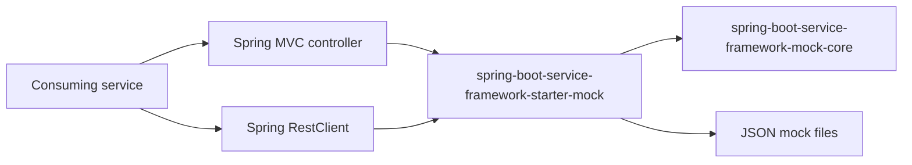

# Mock Core and Starter

This is the canonical guide for the mock module family:

- `spring-boot-service-framework-mock-core`
- `spring-boot-service-framework-starters:spring-boot-service-framework-starter-mock`

The goal is to provide one reusable mock engine that can be called from Spring
MVC controllers, outbound `RestClient` calls, tests, or future custom clients.

---

## 1. Design goals

The mock feature follows the same architecture rule as the rest of the
framework:

- core code is framework-neutral;
- Spring Boot code lives in the starter;
- adapters translate runtime-specific objects into the neutral core contracts.



---

## 2. Module responsibilities

| Module | Responsibility | Must not contain |
|---|---|---|
| `spring-boot-service-framework-mock-core` | Domain model, ports, and default services for mock lookup and response loading orchestration. | Spring, Jackson, Servlet, `RestClient`, Apache, SLF4J. |
| `spring-boot-service-framework-starter-mock` | Spring Boot properties, JSON file loading, controller facade, and outbound `RestClient` interceptor. | Business-specific mock scenarios. |

Consumers upgrading an existing mock integration should update the
`MockService` package and any direct adapter imports using
[Migrate Public Names And Properties](guides/migrate-public-names-and-properties.md).

---

## 3. Core contracts

### `MockRequest`

Neutral request sent to the mock engine.

| Field | Description |
|---|---|
| `key` | Logical mock key, such as `payments-success`. |
| `method` | Optional method or operation, commonly `GET`, `POST`, etc. |
| `path` | Optional HTTP path or resource name. |
| `headers` | Request headers as a multi-value map. |
| `queryParams` | Query parameters as a multi-value map. |
| `body` | Raw request body bytes. |
| `attributes` | Adapter-specific metadata. |

### `MockResponse`

Neutral response returned by the mock engine.

| Field | Description |
|---|---|
| `status` | HTTP-like status code. Invalid values default to `200`. |
| `headers` | Response headers as a multi-value map. |
| `body` | Raw response body bytes. |
| `delay` | Optional artificial delay. |
| `metadata` | Adapter-specific metadata such as source file or key. |

### `MockResponder`

Main core use case:

```java
Optional<MockResponse> respond(MockRequest request);
```

Return `Optional.empty()` when no mock applies. This allows the caller to
continue normal behavior, such as executing the real HTTP request.

---

## 4. Spring Boot properties

All starter properties are under `smbtech.mocks` and are documented in the
generated [Mock Property Reference](mock/property-reference.md).

```yaml
smbtech:
  mocks:
    endpoints:
      payments-success:
        enabled: true
        file: classpath:mocks/payments-success.json
        delay: 100ms
```

OpenAPI mock routes require explicit activation and are blocked when an active
profile matches `prod` or `production`:

```yaml
smbtech:
  mocks:
    openapi:
      enabled: true
      allow-in-production: false
      production-profiles: [prod, production]
      status-override-enabled: false
      contracts:
        warehouse-inventory:
          location: classpath:META-INF/smbtech/openapi/contracts/warehouse-inventory-catalog/1.0.0/contract.yaml
```

`allow-in-production` should only be enabled for an explicitly approved,
isolated environment. Status selection through `X-Mock-Status` is ignored
unless `status-override-enabled` is also enabled.

OpenAPI mock contracts accept explicit OpenAPI 3.0 and 3.1 declarations.
Swagger 2 and unsupported OpenAPI versions fail contract loading.

Generated models JARs contain this collision-free versioned resource. Add the
models artifact as a runtime dependency to drive the mock server from the same
contract that generated the DTOs. Run `smbtechOpenApiMockContractCheck` to list
the classpath location for every configured contract.

## 5. Mock response file format

```json
{
  "status": 201,
  "headers": {
    "Content-Type": "application/json",
    "X-Mock": "true",
    "Set-Cookie": ["a=1", "b=2"]
  },
  "body": {
    "id": "pay-123",
    "status": "MOCKED"
  }
}
```

| Field | Required | Default | Description |
|---|---:|---|---|
| `status` | No | `200` | HTTP status code returned to the adapter. |
| `headers` | No | empty | Response headers. Values may be strings or arrays. |
| `body` | No | empty body | Response body. Objects and arrays are serialized as JSON bytes. |

---

## 6. Controller usage

Inject `com.smbtech.serviceframework.starter.mock.api.MockService` when a
controller should return a configured mock response.

```java
@RestController
class PaymentsController {

    private final MockService mocks;

    PaymentsController(MockService mocks) {
        this.mocks = mocks;
    }

    @GetMapping("/api/dummy")
    ResponseEntity<PaymentResponse> dummy() {
        return mocks.responseOrNotFound("payments-success", PaymentResponse.class);
    }
}
```

Available convenience methods:

```java
Optional<ResponseEntity<String>> response(String mockKey);
<T> Optional<ResponseEntity<T>> response(String mockKey, Class<T> responseType);
<T> Optional<ResponseEntity<T>> response(String mockKey, TypeReference<T> responseType);

ResponseEntity<String> responseOrNotFound(String mockKey);
<T> ResponseEntity<T> responseOrNotFound(String mockKey, Class<T> responseType);
<T> ResponseEntity<T> responseOrNotFound(String mockKey, TypeReference<T> responseType);
```

Use `response(...)` when the controller wants custom fallback logic. Use
`responseOrNotFound(...)` when a missing or disabled mock should return `404`.

---

## 7. RestClient usage

The starter auto-configures a `ClientHttpRequestInterceptor` bean named
`mockRestClientInterceptor`. It adapts outbound Spring `RestClient` requests to
`MockRequest`. Its concrete class is internal.

Mock key resolution:

1. `X-Mock-Key` request header.
2. Normalized path fallback. `/v1/payments` becomes `v1/payments`.

If the mock exists and is enabled, the interceptor returns the mock response. If
not, it executes the real HTTP request.

### Manual RestClient

```java
@Bean
RestClient paymentsRestClient(
        RestClient.Builder builder,
        @Qualifier("mockRestClientInterceptor") ClientHttpRequestInterceptor mockInterceptor
) {
    return builder
            .baseUrl("https://payments.example.test")
            .defaultHeader("X-Mock-Key", "payments-success")
            .requestInterceptor(mockInterceptor)
            .build();
}
```

### Framework RestClient starter

Use the existing customizer hook:

```java
@Bean
RestClientBuilderCustomizer mockRestClientCustomizer(
        @Qualifier("mockRestClientInterceptor") ClientHttpRequestInterceptor mockInterceptor
) {
    return (definition, builder) -> builder.requestInterceptor(mockInterceptor);
}
```

Configure the generated client with a default mock key:

```yaml
smbtech:
  rest-clients:
    clients:
      payments:
        base-url: https://payments.example.test
        default-headers:
          X-Mock-Key: payments-success
  mocks:
    endpoints:
      payments-success:
        enabled: true
        file: classpath:mocks/payments-success.json
```

---

## 8. Test matrix

The mock modules are covered by focused tests at three levels.

| Area | Test coverage |
|---|---|
| Core domain | Null normalization, defensive copies, immutability, default status/delay handling. |
| Core services | Catalog key normalization, missing/disabled mocks, unusable definitions, delay delegation, null response protection. |
| Properties adapter | Null endpoint maps, null endpoint entries, endpoint-to-definition mapping. |
| Resource adapter | Classpath loading, default status, single/multi-value headers, metadata, missing/blank files. |
| Controller facade | `Class<T>`, `TypeReference<T>`, raw `String`, raw `byte[]`, `404` fallback. |
| RestClient adapter | Request mapping, header-based key, path fallback key, mock response short-circuit, real request delegation. |
| Auto-configuration | All expected Spring beans are created and wired. |

Run only mock modules:

```bash
./gradlew :spring-boot-service-framework-mock-core:check \
  :spring-boot-service-framework-starters:spring-boot-service-framework-starter-mock:check
./gradlew mockCompatibilityCheck
```

Run the full framework baseline:

```bash
./gradlew baseline
```

---

## 9. Troubleshooting

Mock issues are covered by the canonical
[Troubleshooting](troubleshooting.md#mock) guide.

---

## 10. Current limitations

The public `MockService` facade is intentionally Spring/Jackson oriented because
it returns `ResponseEntity<T>` and accepts Jackson `TypeReference<T>` for
generic payloads.

For framework-neutral integrations, depend on the core `MockResponder` contract
instead.

Adding `spring-boot-service-framework-starter-mock` does not automatically
replace outbound HTTP calls. Outbound mocks are opt-in: inject the
`mockRestClientInterceptor` bean through `ClientHttpRequestInterceptor` and add
it manually or through the REST client starter customizer hook.

## 11. Planned extensions

Future work can add new adapters without changing the core:

- a `RestClientBuilderCustomizer` auto-bridge controlled by properties;
- a servlet filter/controller helper;
- dynamic mock matching by method/path/query/body;
- response templating;
- test fixtures for consumer projects.

Keep those integrations outside `mock-core`. The stable core contract should
remain `MockRequest -> Optional<MockResponse>`.
